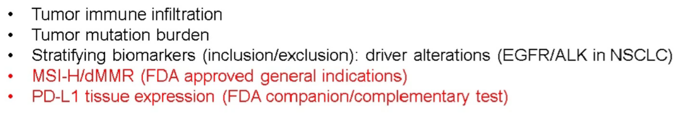
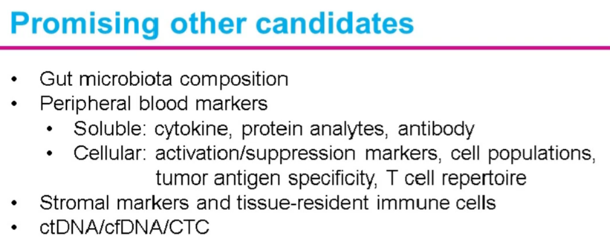
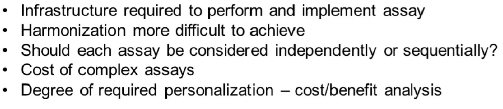

# The changing landscape of diagnostic biomarkers: Exploring the one-biomarker-per-drug paradigm in oncology

- in small-molecule targeted therapies there is a one biomarker per drug paradigm
- for immunotherapy, it's inducing the immune system to recognize a tumor
  - many complex interactions between immune system cells, immunotherapies can affect multiple types of cells
- will need multiple biomarkers
- need:
  - understanding of mechanisms
  - technical expertise for iassay development
  - scientific expertise in human immunology
- want to develop high dimensional assays that are still consistent among different experiments
- current biomarkers
  - 
  - first FDA approved general indications
- 
  - ctDNA (circulating), cf - cell free, CTC (circulating tumor cells)
- localization of immune infiltrate matters
  - patients with high baseline infiltration of CD8 T cells intumors had better response, increase with more treatment
  - high CD8 T cell in stromal elements ONLY had worse responses - need to actually infiltrate the tumor tissue
- TMB
  - more mutation correlates better with higher immunotherapy - more neoantigens/neoepitopes
  - increased OS and PFS
  - higher in NSCLC (higher TMB to begin with)
  - trials have been proposed with just high TMB as indication
- caveats of PD-L1 tissue expression
  - variability from tumor type to tumor type
  - 5 different IHC tests for the different immunotherapies
    - study that tested agreement - some agreed/some disagreed
    - the parts of the cell that are stained matter (cytoplasmic vs. nuclear) so difficult to implement
    - cutoffs different for each type of cancer (hard to measure whether a certain IHC test itself is consistent)
- PD-L1 presence not necessarily correlated with TMB
- CIMAC-CIDC network - use high dimensional assays to look for best biomarkers
  - cytometry
  - staining w/ image analysis
  - complex single-cell transcriptomics
- challenges
  - 
- biomarker types
  - molecular - genes
  - non-molecular - proteins done by IHC, usually dealt with by pathologists
- different assays have been proved for the same target (PD-L1)
  - one of the tests shown to have worse results
  - creating chaos in the path lab because they don't know which treatment the oncologist is going to use, so they have been advised to do multiple assays
- future single protein biomarkers
  - might have a single assay for each new therapy
  - might want to have sequential assays - do one at a time and then get approved for the next one
    - especially important for combination protein biomarkers
  - otherwise having one assay per treatment is going to result in higher costs/complexities
  - pharma companies have been developing the assays - don't have incentive to create complex assays because want to increase the number of labs that can do the assay
  - barriers
    - mechanisms behind immunotherapies
    - cost - pathologists will want to charge for each assay, don't get reimbursed a lot for IHC
      - NGS has been adopted because it was necessary
    - multiplexing - complex but useful, figure out how to make better/more consistent
  - antibodies mostly similar, but when put in the assays they behave differently - can't just mix the assays together
    - some labs have started just measuring PD-L1 separately and then using that as their standard
    - problem with the different scoring systems between different diseases is still there
  - want to look for **circulating markers (easier to measure), microbiomes - stool, tissue level, periphery**
    - fresh tissue not always available
- opinions on multiple biomarker panels
  - have panels like WES - characterize TMB and mutations that can be targeted
  - need to find most important dimensions - **multiplexed immunohistochemistry (?)**
  - does the tissue have all the information you need
    - use unsupervised AI vs. supervised annotated model
  - other person - not optimistic about TMB (cutoff doesn't have enough sensitivity/specificiti)
    - wants to use larger assays to find smaller subset of factors
- who can accelerate multiplex IHC - there is a part 2 to this seminar
